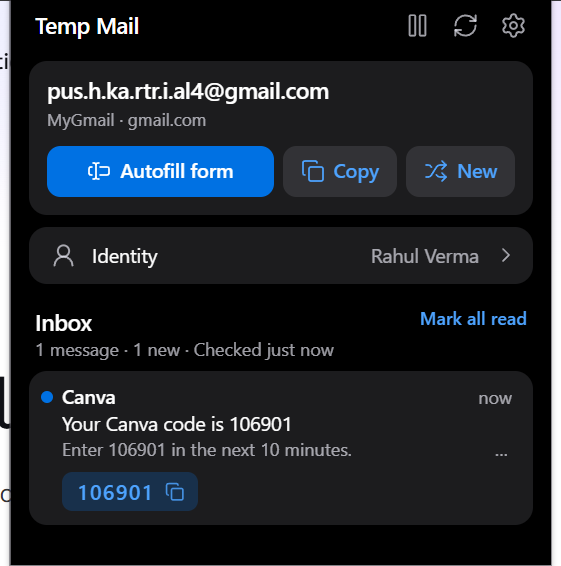
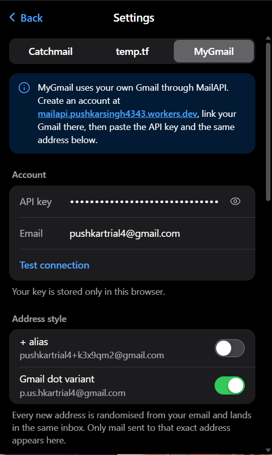

<div align="center">


# TempMail — Disposable Email

**A persistent disposable inbox for Chrome & Brave — with one-click form autofill, OTP copy and zero setup.**

[](https://developer.chrome.com/docs/extensions/develop/concepts/manifest-v3)
[](LICENSE)
[](https://github.com/nullstacks/temp-mail-extension/releases/latest)
[](#requirements)

**[Install](INSTALL.md)** · **[Features](#features)** · **[Screenshots](#screenshots)** · **[Releases](https://github.com/nullstacks/temp-mail-extension/releases)**

</div>

---

Most temp-mail sites make you refresh a page and fight CAPTCHAs. TempMail lives in your browser: a real inbox that polls in the background, fills any signup form in one keystroke, and keeps the same address for as long as you want it — until you press **Change**. No account, no API keys, no build step.

## Features

- **Address that stays put** — same address across tabs, sessions and browser restarts until you rotate it
- **One-click form autofill** — the mini email icon inside every email field: click = fill email, `Shift+click` = autofill the whole form
- **Full form filling** — email, name, username, password, gender, age/DOB, phone, address, city, state, ZIP/PIN, country (dropdowns & radios included)
- **Fake identity generator** — US, India, UK, Canada, Australia, Germany, with city/state/postcode kept consistent
- **Live inbox** — background polling with unread badge and desktop notifications
- **OTP detection** — verification codes surface as one-click copy chips; verification links detected too
- **Safe message viewer** — sandboxed iframe, remote images blocked until you allow them, attachments downloadable
- **Privacy controls** — pause button stops all background checks and notifications; address history (last 5)
- **Two mail providers** — Catchmail (3 domains + custom domains via MX) and temp.tf, switchable in Settings

## Screenshots

| Inbox | Settings |
|:---:|:---:|
|  |  |
| *Persistent address, fake identity, live inbox with OTP chip* | *Provider switcher, custom domains, autofill & identity preferences* |

## Install

Works in Chrome and Brave (Manifest V3). No build step, no dependencies.

```bash
git clone https://github.com/nullstacks/temp-mail-extension.git
```

Then open `chrome://extensions` (or `brave://extensions`) → enable **Developer mode** → **Load unpacked** → select the cloned folder.

Prefer a zip? Download the `.zip` attached to the [latest release](https://github.com/nullstacks/temp-mail-extension/releases/latest), unzip, and load that folder instead.

> 📖 Full walkthrough — including updating, uninstalling and troubleshooting: **[INSTALL.md](INSTALL.md)**

## How it works

| | |
|---|---|
| **Providers** | Catchmail's open API (`api.catchmail.io`): any address works instantly on Catchmail domains — or point your own domain's MX at `smtp.catchmail.io` for a private inbox. temp.tf gives Gmail/Outlook/Hotmail-style addresses with dot & plus aliases. |
| **Automation** | An MV3 service worker polls the inbox (default 5 s), raises the unread badge and fires desktop notifications. The popup reuses the shared result instead of making its own requests. |
| **Autofill** | A content script watches for email fields and injects the always-visible mini icon; Shift+click fills the entire form, dropdowns and radios included. Shortcuts: `Alt+Shift+F` (autofill), `Alt+Shift+M` (open popup). |
| **Viewer** | Message HTML renders inside a sandboxed iframe; remote images stay blocked until you press Load. |

<details>
<summary><b>Performance notes (1.3.1)</b></summary>

- **Catchmail polling:** the message list is fetched each poll, but full bodies are fetched only once per message (newest first, 3 per poll) and cached — previously every poll re-downloaded every message. All Catchmail calls are spaced ≥1.05 s apart to respect the 1 req/s limit. Bodies not yet fetched are loaded on demand when you open the message.
- **One poller:** the service worker polls; the popup reads the shared result and live-updates from storage instead of making its own requests. Concurrent refreshes share a single request.
- **Storage:** the inbox is rewritten only when it changes; an unchanged poll writes a ~100-byte record. Settings are cached in memory.
- **Backoff / idle:** fast polling backs off exponentially on errors and stops after 10 min with no new mail (the 30 s alarm continues); opening the popup or receiving mail resumes it.
- **Content script:** no work until an email field exists; only fields inside the viewport are measured (IntersectionObserver); DOM changes are scanned incrementally (added nodes only); layout reads/writes are batched; no timers run while no email field is on screen; tiny iframes are skipped; turning the icon off detaches everything.

</details>

## Privacy

- Everything (address, inbox, history, settings) is stored **locally** in your browser
- No analytics, no trackers, no telemetry, no third-party requests beyond the mail providers you pick
- Catchmail mailboxes are anonymous and create-only; custom domains stay private (unreadable to others)
- Fake identities are randomly generated — for testing and privacy only, never for impersonation

## Contributing

Issues and PRs welcome — [open an issue](https://github.com/nullstacks/temp-mail-extension/issues) or fork and send a pull request. For bugs, include your Chrome/Brave version and the affected provider.

## License

[MIT](LICENSE) © [Nullstacks](https://github.com/nullstacks)
