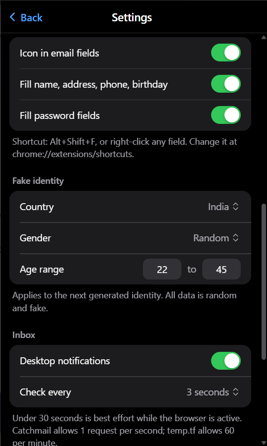

<div align="center">


# TempMail — Disposable Email

**A persistent disposable inbox for Chrome & Brave — with one-click form autofill, OTP copy and zero setup.**

[](#install)
[](LICENSE)
[](https://github.com/nullstacks/temp-mail-extension/releases/latest)
[](#whats-new-in-151)
[](#requirements)

**[Install](INSTALL.md)** · **[Features](#features)** · **[Screenshots](#screenshots)** · **[Releases](https://github.com/nullstacks/temp-mail-extension/releases)**

</div>

---

Most temp-mail sites make you refresh a page and fight CAPTCHAs. TempMail lives in your browser: a real inbox that polls in the background, fills any signup form in one keystroke, and keeps the same address for as long as you want it — until you press **New**. No account, no API keys, no build step.

## Features

- **Address that stays put** — same address across tabs, sessions and browser restarts until you rotate it
- **One-click form autofill** — the mini email icon inside every email field: click = fill email, `Shift+click` = autofill the whole form
- **Full form filling** — email, name, username, password, gender, age/DOB, phone, address, city, state, ZIP/PIN, country (dropdowns & radios included)
- **Fake identity generator** — US, India, UK, Canada, Australia, Germany, with city/state/postcode kept consistent
- **Live inbox** — background polling with unread badge and desktop notifications
- **OTP detection** — verification codes surface as one-click copy chips; verification links detected too
- **Safe message viewer** — sandboxed iframe, remote images blocked until you allow them, attachments downloadable
- **Privacy controls** — pause button (⏸) stops all background checks, wake-ups and notifications until you resume; address history (last 5)
- **Three mail providers** — Catchmail (3 domains + custom domains via MX), temp.tf, and **MyGmail**: your own Gmail via +aliases and dot variants, switchable in Settings
- **Native-feeling design** — clean system-font UI in the spirit of Apple's Passwords and Notes: grouped lists, automatic light/dark, honest waiting states, visible focus

## What's new in 1.5.1

- **MyGmail provider** — use your own Gmail as the disposable address: `you+tag@gmail.com` (+aliases) or `y.o.u@gmail.com` (dot variants), filtered per address through [MailAPI](https://mailapi.pushkarsingh4343.workers.dev/). Key stays in local storage; the MailAPI host is an *optional* permission granted only when you pick MyGmail. See [MyGmail setup](#mygmail-setup).
- **Pause button** — ⏸ in the popup header halts all automatic polling, alarms, wake-ups and notifications; ↻ still refreshes manually, and resuming catches up immediately.
- **Redesigned popup** — the toolbar popup was rebuilt as a clean, native-feeling utility: system typography, inset grouped lists with hairline separators, native-style switches / segmented controls / pop-up menus, semantic colours and automatic light/dark. Autofill is the primary action; the inbox leads each message with its code. No web fonts or remote assets — the popup never makes a request of its own.
- **Popup that fits its content** — the height always matches what's shown, up to Chrome's 600 px cap: short with an empty inbox, growing as mail or panels arrive.
- Refreshed toolbar icon set.

## Screenshots

| Popup | Settings · MyGmail | Settings · Autofill & Inbox |
|:---:|:---:|:---:|
|  |  |  |
| *Address, identity, live inbox with OTP chip* | *MyGmail: API key, alias & dot-variant toggles* | *Autofill, identity, notification preferences* |

## Install

Works in Chrome and Brave (Manifest V3). No build step, no dependencies.

```bash
git clone https://github.com/nullstacks/temp-mail-extension.git
```

Then open `chrome://extensions` (or `brave://extensions`) → enable **Developer mode** → **Load unpacked** → select the cloned folder.

Prefer a zip? Download the `.zip` attached to the [latest release](https://github.com/nullstacks/temp-mail-extension/releases/latest), unzip, and load that folder instead.

> 📖 Full walkthrough — including updating, uninstalling and troubleshooting: **[INSTALL.md](INSTALL.md)**

## MyGmail setup

Optional provider — the default Catchmail/temp.tf flow needs no account and no keys.

1. Create an account at [mailapi.pushkarsingh4343.workers.dev](https://mailapi.pushkarsingh4343.workers.dev/) and link your Gmail there. Gmail delivers `you+anything@gmail.com` and `y.o.u@gmail.com` to your normal inbox; MailAPI filters the mailbox per address, so each signup address only shows its own mail.
2. In the extension: Settings → **MyGmail** → paste the API key and the same Gmail address, then press **Test connection**.
3. Pick the address style: **+ alias** (`you+k3x9qm2@gmail.com`), **dot variant** (`y.ou@gmail.com`), or both. Both off uses your plain address and shows your whole inbox.
4. Press **New** for a freshly randomised address.

Notes: access to the MailAPI host is requested the first time you pick MyGmail (optional permission — other providers never need it). The API key is stored in `chrome.storage.local` on this browser only. Polling is cheap: an ids-only request each check, and a message is downloaded once, only when it is new. Each saved address remembers its provider, so a `@gmail.com` address from temp.tf and one from MyGmail are never confused.

## How it works

| | |
|---|---|
| **Providers** | Catchmail's open API (`api.catchmail.io`): any address works instantly on Catchmail domains — or point your own domain's MX at `smtp.catchmail.io` for a private inbox. temp.tf gives Gmail/Outlook/Hotmail-style addresses with dot & plus aliases. MyGmail serves filtered +alias/dot variants of your own Gmail through your MailAPI account. |
| **Automation** | An MV3 service worker polls the inbox (default ≈5 s), raises the unread badge and fires desktop notifications. The popup reuses the shared result instead of making its own requests. Pause (⏸) clears the alarm and stops all timers until you resume. |
| **Autofill** | A content script watches for email fields and injects the always-visible mini icon; Shift+click fills the entire form, dropdowns and radios included. Shortcuts: `Alt+Shift+F` (autofill), `Alt+Shift+M` (open popup). |
| **Viewer** | Message HTML renders inside a sandboxed iframe; remote images stay blocked until you press Load. |

<details>
<summary><b>Performance notes (1.5.1)</b></summary>

- **Catchmail polling:** the message list is fetched each poll, but full bodies are fetched only once per message (newest first, 3 per poll) and cached — previously every poll re-downloaded every message. All Catchmail calls are spaced ≥1.05 s apart to respect the 1 req/s limit. Bodies not yet fetched are loaded on demand when you open the message.
- **One poller:** the service worker polls; the popup reads the shared result and live-updates from storage instead of making its own requests. Concurrent refreshes share a single request.
- **Storage:** the inbox is rewritten only when it changes; an unchanged poll writes a ~100-byte record. Settings are cached in memory.
- **Backoff / idle:** fast polling backs off exponentially on errors and stops after 10 min with no new mail (the 30 s alarm continues); opening the popup or receiving mail resumes it. Pausing clears the alarm entirely — no wake-ups at all.
- **Content script:** no work until an email field exists; only fields inside the viewport are measured (IntersectionObserver); DOM changes are scanned incrementally (added nodes only); layout reads/writes are batched; no timers run while no email field is on screen; tiny iframes are skipped; turning the icon off detaches everything.
- **MyGmail:** an ids-only request each check; a message is downloaded once, only when it is new.

</details>

## Privacy

- Everything (address, inbox, history, settings) is stored **locally** in your browser
- No analytics, no trackers, no telemetry, no third-party requests beyond the mail providers you pick
- Catchmail mailboxes are anonymous and create-only; custom domains stay private (unreadable to others)
- MyGmail: the API key never leaves this browser's `chrome.storage.local`; mail flows through your own MailAPI account
- Fake identities are randomly generated — for testing and privacy only, never for impersonation

## Contributing

Issues and PRs welcome — [open an issue](https://github.com/nullstacks/temp-mail-extension/issues) or fork and send a pull request. For bugs, include your Chrome/Brave version and the affected provider.

## License

[MIT](LICENSE) © [Nullstacks](https://github.com/nullstacks)
